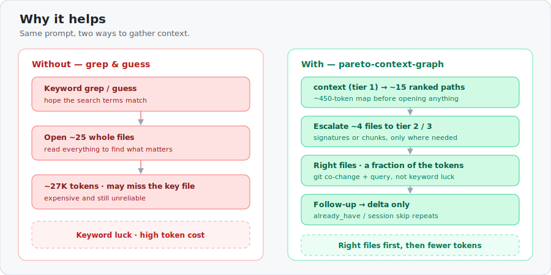
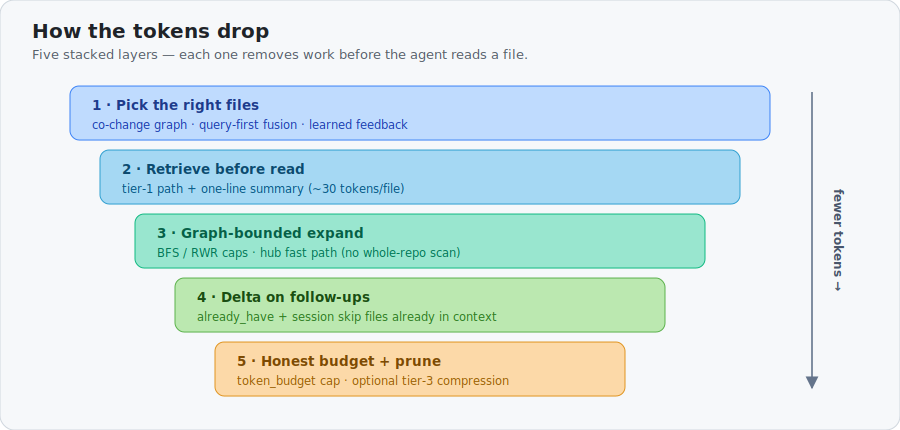

# pareto-context-graph

**Give AI coding assistants the right context for every prompt — from any repo.**

An MCP server that learns file relationships from git history and returns a ranked,
token-budgeted list of files for any question, change, or debug session. Instead of
guessing what to read, the agent gets files that provably matter — then escalates
detail only where needed.

**Core runtime:** Python 3.10+ stdlib (SQLite, git CLI). No external service required.

**Huge repos (kubernetes, linux):** use a [CI or team snapshot](docs/CI_SNAPSHOTS.md) — `build --from-snapshot` — instead of a multi-hour cold build.

---

## Install

```bash
pip install pareto-context-graph
# recommended: accurate token budgets
pip install "pareto-context-graph[tiktoken]"
# or from source
pip install -e /path/to/pareto-context-graph
pip install -e "/path/to/pareto-context-graph[tiktoken]"
```

**One-shot onboarding** (build + MCP install + next steps):

```bash
cd /path/to/your-repo
pareto-context-graph init --platform cursor
# restart Cursor
```

Or step by step: `build` → `install` → `serve --watch`. After commits: `pareto-context-graph sync`.

**Cursor MCP** — manual config:

```json
{
  "mcpServers": {
    "pareto-context-graph": {
      "command": "pareto-context-graph",
      "args": ["serve", "--repo", "/absolute/path/to/your-repo"]
    }
  }
}
```

Full setup: [docs/QUICKSTART.md](docs/QUICKSTART.md)

---

## What problem this solves

Every repo prompt needs context. Without guidance, agents **read too much**, **read too
little**, or **read the wrong files**. The fix is not “fewer tokens” alone — it is
**better file selection**, then **honest budgets**, then optional compression.



| | Without tool | With tool |
|---|---|---|
| Files in scope | Whole repo | ~15 co-change ranked |
| First turn cost | ~25 guessed full files | **~450 tokens** tier-1 map |
| Relevance | Keyword luck | Git history + imports + query |

---

## How context improves and tokens drop

**Right files first, then fewer tokens.**





| Layer | What it does |
|-------|----------------|
| **Right files** | Co-change graph, query-first fusion, feedback learning |
| **Retrieve before read** | Tier 1 summaries (~30 tok/file) before opening files |
| **Graph-bounded expand** | BFS/RWR caps; hub fast path (**6 ms** p95 on k8s/linux) |
| **Delta context** | `already_have` + session skip on follow-ups |
| **Honest budgets** | `token_budget`, tiktoken; optional in-house prune on tier 3 |

**North star** (measurable): `recall@5` → `budget_honesty` → `reduction_vs_agent` → optional compress.



---

## C4 overview


Containers, components, and pipeline phases: **[Architecture](docs/ARCHITECTURE.md)**

---

## CRG — design inspiration (not a dependency)

[code-review-graph (CRG)](https://github.com/tirth8205/code-review-graph) informed some design choices
(structural edges, Leiden communities, install flow). **We do not import CRG** — all retrieval,
ranking, compression, and MCP logic lives in this repo.
fastapi is a shared **eval benchmark** repo, not a library dependency.

Tier-3 compression is **built in** (`compression: prune` + `retrieve`). See
[CONTEXT_COMPRESSION.md](docs/CONTEXT_COMPRESSION.md).

---

## Documentation

| # | Topic | Doc |
|---|--------|-----|
| 1 | **Quick start** — install, build, editor | [docs/QUICKSTART.md](docs/QUICKSTART.md) |
| 1b | **Huge-repo snapshots** — k8s CI artifact, linux team export | [docs/CI_SNAPSHOTS.md](docs/CI_SNAPSHOTS.md) |
| 2 | **Architecture** — C4, pipeline, modules, storage | [docs/ARCHITECTURE.md](docs/ARCHITECTURE.md) |
| 3 | **Commands & CLI** — `context` params, all commands, flags | [docs/COMMANDS.md](docs/COMMANDS.md) |
| 4 | **Benchmarks** — OSS numbers, profiles, eval gates | [docs/BENCHMARKS.md](docs/BENCHMARKS.md) |
| 5 | **Optional features** — embeddings, ranker, hooks, compression, Docker | [docs/OPTIONAL_FEATURES.md](docs/OPTIONAL_FEATURES.md) |

### More reference

| Doc | Audience | Contents |
|-----|----------|----------|
| [diagrams/](docs/diagrams/) | All | Mermaid/C4 sources + SVGs (`make render-diagrams`) |
| [BENCHMARK_REPOS.md](docs/BENCHMARK_REPOS.md) | Bench / CI | Clone/build recipes for T1–T3 |
| [tests/eval/README.md](tests/eval/README.md) | Contributors | Golden eval schema + metrics |
| [FEEDBACK.md](docs/FEEDBACK.md) | Integrators | Feedback learning loop |
| [PHASES.md](docs/PHASES.md) | Maintainers | Execution plan, milestones, open items |
