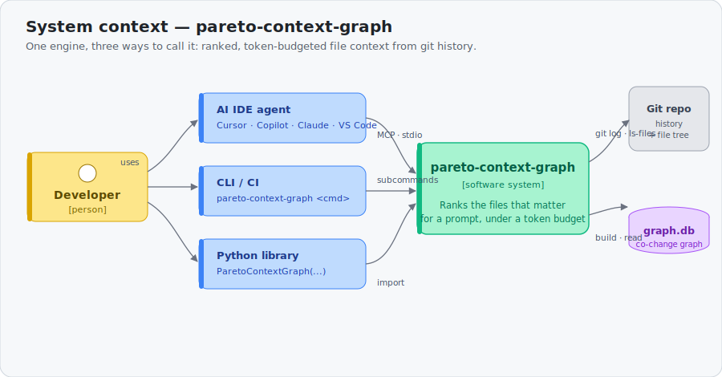
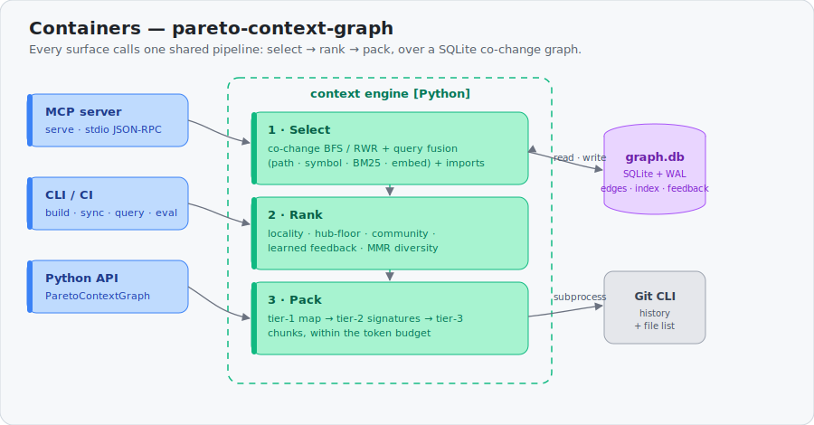
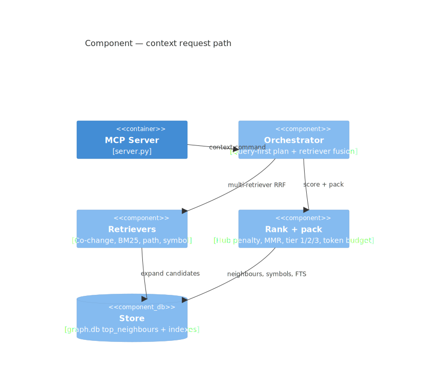
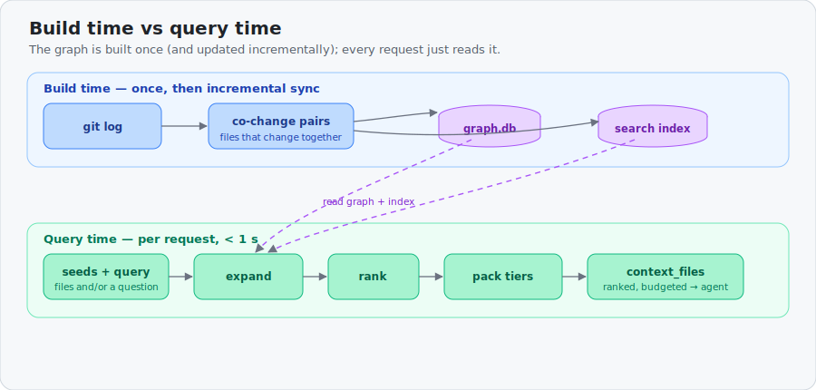
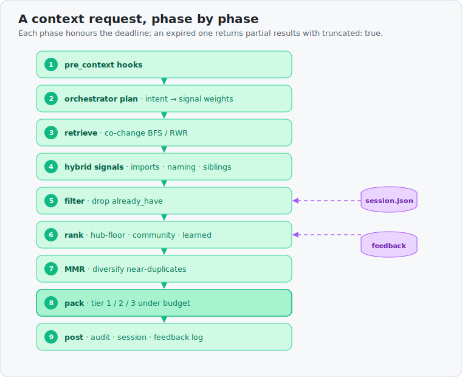

# Architecture

Technical reference for how **pareto-context-graph** is built and how a `context` request flows.

User-facing story + C4 zoom levels: [README § C4 model](../README.md#c4-model) ·
[diagram sources](diagrams/).

> Diagrams are embedded SVGs (editable `.mmd` in [`diagrams/`](diagrams/)).

---

## C4 model (summary)







---

## System overview





---

## Retrieval signals

| Signal | Source | Role |
|--------|--------|------|
| **Co-change** (primary) | Git commit file pairs | Files that changed together are coupled |
| **Import/require** | Regex + tree-sitter over 7 language families | Static dependency edges |
| **Route edges** | FastAPI/Flask `@router.get`, `include_router` | Handler → route wiring |
| **Naming pairs** | `foo.rb` ↔ `foo_spec.rb` | Test/impl pairing |
| **Query-first fusion** | BM25 + co-change + path + symbol retrievers | Question-only context (no seed files) |
| **TF-IDF / keyword index** | Lazy-built per repo | Query-term boosting (skipped on huge/high-fanout) |
| **Structural edges** | AST/import graph (optional) | Blast-radius traversal |
| **Embeddings** | Optional sidecar | 0.15 blend weight when built |
| **Learned weights** | `feedback_*` → `learn` | Per-file boosts from real usage |

---

## `context` pipeline (runtime)



Each phase honours `timeout_ms` (default **5000 ms**). Expired or cancelled requests return
partial results with `truncated: true` and `truncated_phase` (`retrieve`, `hybrid`, `rank`,
`pack`, …).

**High-fanout fast path** (hub degree ≥ 500): BFS depth-1 only, cap 75 candidates, skip
hybrid/semantic/MMR — prevents multi-minute hub blow-ups on files like `MAINTAINERS` or
`go.mod`.

---

## Module map

```
src/pareto_context_graph/
├── server.py          # MCP JSON-RPC — single `pareto_context_graph` tool, full context pipeline
├── orchestrator.py    # Query-first: plan → multi-retriever RRF fusion
├── retrievers.py      # Co-change, BM25, path, symbol retrievers
├── adaptive_cap.py    # Query-complexity stage1 cap (P0 token reduction)
├── session.py         # .pareto-context-graph/session.json → auto already_have
├── blast.py           # Blast radius, imports, naming, summaries, intent
├── chunks.py          # Tier 2/3 chunks, symbols, TF-IDF keyword index
├── graph.py           # Git log → co-change pairs → SQLite (sharded build)
├── store.py           # SQLite: files, edges, FTS5, communities, feedback
├── pool.py            # WAL + concurrent read pool for context hot path
├── deadlines.py       # Per-request deadline ticks, hub thresholds
├── cancellation.py    # MCP notifications/cancelled support
├── walk.py            # Random walk with restart (huge profile)
├── ranker.py          # Logistic / LambdaMART re-ranker from feedback
├── feedback.py        # events.jsonl + SQLite feedback fold
├── feedback_replay.py # Held-out replay eval for learn loop
├── savings.py         # context_savings + agent grep baseline
├── eval.py            # Golden-case harness + regression gate
├── bench.py           # OSS stress bench (build + latency + token_savings)
├── profiles.py        # tiny/medium/large/huge presets + cached autodetect
├── tokenizer.py       # tiktoken / bytes heuristic token counting
├── embed.py           # Optional embeddings sidecar
├── structural.py      # Structural + route edge extraction
├── route_edges.py     # FastAPI/Flask route → handler edges
├── repo_registry.py   # serve --repo-map multi-repo routing
├── staleness.py       # Index staleness banners + catch-up on connect
├── server_instructions.py  # MCP initialize agent playbook
├── agent_install.py   # install / uninstall editor MCP configs
├── agent_ab.py        # Headless PCG vs grep+read A/B harness
├── affected.py        # Reverse-walk test selection for changed files
├── watcher_health.py  # Watcher error metrics (no silent swallow)
├── build_estimate.py  # doctor cold-build estimate
├── neighbour_cache.py # In-memory top_neighbours (build hot path)
├── repo_config.py     # Default path exclusions + lazy/eager index mode
├── indexing.py        # Phased search index (lazy on huge profiles)
├── symbols.py         # Tree-sitter (default) or regex symbol index
├── community.py       # Leiden communities (optional igraph)
├── payload_compress.py  # Query-aware prune + payload cache + retrieve
├── summary_prune.py   # Tier-1 post-pack summary/query mismatch prune (11.4)
├── selective_hybrid.py  # Large-repo query-only BM25/TF-IDF policy (11.2)
├── prune_learn.py       # Learned prune biases + tier-1 post-pack prune (11.6)
├── compress_stack.py    # Eval compression column (tier-3 → compressed)
├── headroom_stack.py    # Deprecated shim → compress_stack
├── signing.py         # HMAC + optional Ed25519 snapshot signing
├── policy.py          # Layered org/repo policy (YAML+JSON), context defaults
├── audit.py           # .pareto-context-graph/audit.jsonl
├── metrics.py         # In-process Prometheus counters + context phase histograms
├── tracing.py         # In-process spans + optional OTLP export for context phases
├── hooks.py           # Repo-local hook loading + secret redaction
├── snapshot.py        # Export/import .pareto-context-graph tarballs
├── daemon.py          # Native watcher + debounced incremental sync
├── api.py             # Python API (no MCP protocol)
└── cli.py             # CLI entry point
```

---

## Storage (`.pareto-context-graph/`)

| File | Purpose |
|------|---------|
| `graph.db` | SQLite graph (add to `.gitignore`) |
| `weights.json` | Learned per-file ranking boosts |
| `ranker.json` / `ranker.lgb.txt` | Trained re-ranker (optional) |
| `events.jsonl` | Append-only feedback + counterfactual log |
| `session.json` | Recent context paths for delta follow-ups |
| `audit.jsonl` | Request audit trail (rotates to `audit.jsonl.1`, … per policy) |
| `policy.json` | Repo-local policy overrides (merged on top of org policy) |
| `hooks/` | Python extension hooks |

**Audit retention:** `.pareto-context-graph/audit.jsonl` rotates when it reaches
**10 MiB** (default). The active file becomes `audit.jsonl.1`, older segments shift
up, and only **5** files total are kept (`audit.jsonl` + `.1` … `.4`). Override via
repo `.pareto-context-graph/policy.json`:

```json
{ "audit": { "max_bytes": 10485760, "max_files": 5 } }
```

Environment: `PCG_AUDIT_MAX_BYTES`, `PCG_AUDIT_MAX_FILES`, `PCG_AUDIT_ROTATION=0`
to disable, `PCG_DISABLE_AUDIT=1` to stop logging entirely.

**Org policy:** Files merge weakest → strongest:
`/etc/pareto-context-graph/policy.yaml`, `/etc/pareto-context-graph/policy.json`, `$PCG_POLICY`, then
`.pareto-context-graph/policy.json`. YAML requires optional `pyyaml` (`pip install pareto-context-graph[policy]`).
Context knobs applied before hooks: `default_tier`, `token_budget_default`, `max_token_budget`,
`session_memory`, `profile_default`, `allow_no_safety`. Hook SHA-256 allowlists union across layers.
Override org path in tests via `PCG_ORG_POLICY_DIR`.

**Tracing:** Context requests emit `context` + `context.<phase>` spans.
Enable OTLP with `OTEL_EXPORTER_OTLP_ENDPOINT` (or `PCG_OTEL_ENDPOINT`) and optional
`OTEL_EXPORTER_OTLP_PROTOCOL` (`http/protobuf` default, or `grpc`). Install
`pip install pareto-context-graph[otel]`. In-process buffer remains on `/traces` when metrics
server runs (`pareto-context-graph metrics --serve`). Docker Compose ships an `otel-collector`
service on port 4318.

---

## Related docs

| Doc | Contents |
|-----|----------|
| [QUICKSTART.md](QUICKSTART.md) | Install, build, editor setup |
| [COMMANDS.md](COMMANDS.md) | `context` params, all commands, CLI, feature flags |
| [OPTIONAL_FEATURES.md](OPTIONAL_FEATURES.md) | Embeddings, ranker, hooks, compression, Docker |
| [CONTEXT_COMPRESSION.md](CONTEXT_COMPRESSION.md) | Built-in tier-3 prune + retrieve |
| [ROADMAP.md](ROADMAP.md) | Open work and known issues |
| [FEEDBACK.md](FEEDBACK.md) | Learn loop from agent usage |
| [HOOKS.md](HOOKS.md) | Repo-local extension hooks |
| [BENCHMARKS.md](BENCHMARKS.md) | Latency and build numbers |
