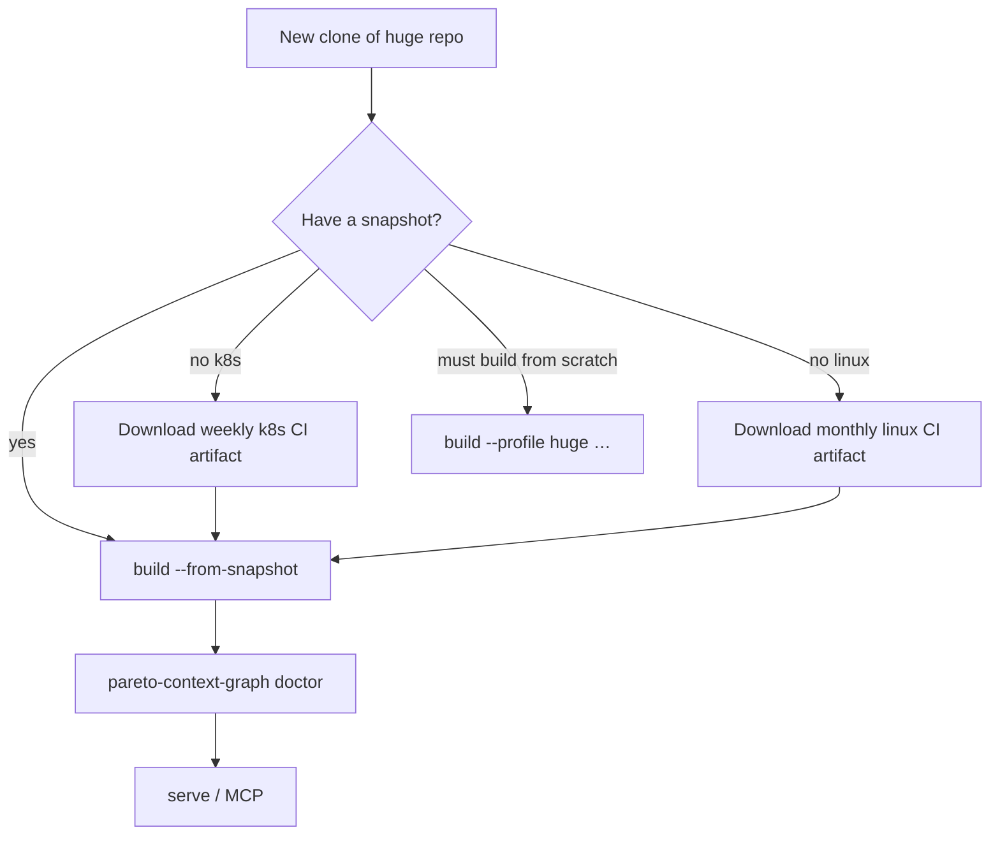

# CI Snapshots — huge-repo onboarding

Pre-built `.pareto-context-graph` tarballs avoid multi-hour cold builds on Tier 2/3 repos.
**Default path for kubernetes and linux:** import a snapshot, then `sync` (or `build` for first import).

| Repo tier | Cold build (measured) | Snapshot path |
|-----------|----------------------|---------------|
| T1 (fastapi, httpx) | ~1–2 s | Not needed — `pareto-context-graph init` or `build` |
| T2 (kubernetes) | ~13 min | **Weekly CI artifact** (recommended) |
| T3 (linux) | ~1–2 h co-change (lazy index) | **Monthly CI artifact** (recommended) |

---

## When to use what



---

## Kubernetes (T2) — recommended flow

**Target:** snapshot import + incremental update **< 5 min** (vs ~13 min cold build).

### 1. Clone the repo

```bash
git clone --filter=blob:none https://github.com/kubernetes/kubernetes.git bench/kubernetes
cd bench/kubernetes
sha=$(jq -r '.repos.kubernetes.sha' ../../tests/eval/pins.json)  # optional pin
git checkout "$sha" 2>/dev/null || true
```

### 2. Get the CI snapshot

**GitHub Actions:** **Actions → Bench T2 (Kubernetes) →** latest run → artifact **`kubernetes-graph-snapshot`**

Download and extract (or use the `.tar.gz` directly):

```bash
# Example: artifact saved to ~/Downloads/kubernetes-graph-snapshot.tar.gz
export PCG_SNAPSHOT_KEY='<same secret as CI>'   # if signed
```

### 3. Bootstrap from snapshot

`build --from-snapshot` imports the tarball **and** runs an incremental update for commits since the snapshot.

```bash
pip install -e /path/to/pareto-context-graph[tiktoken]

pareto-context-graph init --from-snapshot ~/Downloads/kubernetes-graph-snapshot.tar.gz --skip-install
pareto-context-graph install --platform cursor
```

Also accepts HTTPS URLs:

```bash
pareto-context-graph build --from-snapshot https://example.com/kubernetes-graph-snapshot.tar.gz
```

### 4. Verify

```bash
pareto-context-graph stats
pareto-context-graph doctor    # health + build estimate
```

### 5. Serve MCP

```bash
pareto-context-graph install --platform cursor
pareto-context-graph serve --watch --interval 600
```

### Day-to-day updates

```bash
git pull
git pull
pareto-context-graph sync --with-index   # incremental graph + index catch-up
# or: pareto-context-graph update
```

---

## Linux (T3) — monthly CI snapshot (recommended)

**Target:** snapshot import + incremental update in **minutes** (vs ~1–2 h co-change cold build).

### 1. Get the CI snapshot

**GitHub Actions:** **Actions → Bench T3 (Linux) →** latest monthly run → artifact **`linux-graph-snapshot`**

### 2. Bootstrap from snapshot

```bash
git clone --filter=blob:none https://github.com/torvalds/linux.git bench/linux
cd bench/linux

export PCG_SNAPSHOT_KEY='<same secret as CI>'   # if signed
pareto-context-graph build --from-snapshot ~/Downloads/linux-graph-snapshot.tar.gz
pareto-context-graph doctor
```

### 3. Team export (fallback)

If CI artifact is unavailable, import a teammate export:

```bash
pareto-context-graph build --from-snapshot /path/to/linux-graph-snapshot.tar.gz
```

### 4. Cold build (last resort)

```bash
pareto-context-graph build --profile huge-full \
  --since "24 months ago" \
  --commits 100000 \
  --shards 8
```

Phase 2 search index is lazy by default — run `pareto-context-graph index` when you need symbol search.

See [BENCHMARK_REPOS.md](BENCHMARK_REPOS.md) for measured timings.

---

## Signing and verification

| Env var | Purpose |
|---------|---------|
| `PCG_SNAPSHOT_KEY` | HMAC key — CI signs exports; set locally to verify imports |
| `PCG_REQUIRE_SIGNED_SNAPSHOTS=1` | Refuse unsigned snapshots |
| `PCG_ED25519_KEY` | Optional Ed25519 (requires `pip install cryptography`) |

Manual import/export:

```bash
pareto-context-graph snapshot export ./my-graph.tar.gz    # writes .sig.json
pareto-context-graph snapshot import ./my-graph.tar.gz    # verifies when key set
```

CI verifies signatures after export when `PCG_SNAPSHOT_KEY` is configured (see `bench-t2.yml`).

---

## CI publisher (maintainers)

Weekly workflow [`.github/workflows/bench-t2.yml`](../.github/workflows/bench-t2.yml):

1. Build kubernetes graph (`--profile huge`, 5k commits, 4 shards).
2. Eval regression (`eval-check-kubernetes`, `eval-audit-kubernetes`).
3. Export:
   ```bash
   export PCG_SNAPSHOT_KEY='…'   # GitHub Actions secret
   pareto-context-graph snapshot export ./kubernetes-graph-snapshot.tar.gz
   ```
4. Upload **`kubernetes-graph-snapshot`** artifact (14-day retention): tarball + `.sig.json`.

---

## Troubleshooting

| Symptom | Fix |
|---------|-----|
| `snapshot signature verification failed` | Set `PCG_SNAPSHOT_KEY` to match CI secret, or use unsigned export without `PCG_REQUIRE_SIGNED_SNAPSHOTS` |
| `missing snapshot source` on export | Run `pareto-context-graph build` first — `.pareto-context-graph/` must exist |
| Import OK but stale graph | `git pull` then `pareto-context-graph sync` (or `sync --with-index`) |
| `doctor` shows 0 files | Wrong repo root — run commands from git toplevel |
| Hub context slow | See [BENCHMARKS.md](BENCHMARKS.md) — should be sub-second on k8s/linux |

---

## Build profiling (optional)

Where cold-build time goes:

```bash
make profile-build REPO=bench/kubernetes SHOW=1
make profile-build REPO=bench/kubernetes REPLAY=1
```

Recorded breakdowns: [BENCHMARKS.md](BENCHMARKS.md).

---

## Related docs

- [QUICKSTART.md](QUICKSTART.md) — `init`, `sync`, editor wiring
- [BENCHMARK_REPOS.md](BENCHMARK_REPOS.md) — tier recipes and disk estimates
- [COMMANDS.md](COMMANDS.md) — `init`, `build --from-snapshot`, `sync`, `snapshot export|import`
