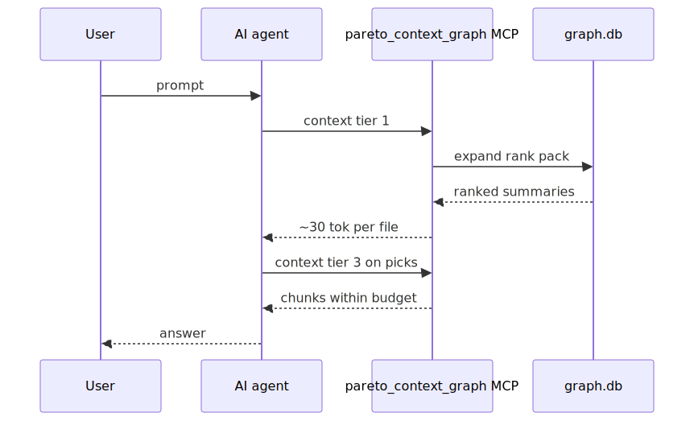

# Commands, parameters & CLI reference

MCP exposes a single tool `pareto_context_graph` with a `command` parameter (~200 tokens schema
overhead vs ~1000 for many tools). CLI mirrors the same surface.

See also: [QUICKSTART.md](QUICKSTART.md) · [ARCHITECTURE.md](ARCHITECTURE.md)

---

## `context` — primary command



### Example calls

**With seed files:**

```json
{
  "command": "context",
  "files": ["app/controllers/login_controller.rb"],
  "query": "add rate limiting to login",
  "tier": 1
}
```

**Query-only** (no seeds; default when `PCG_FEATURE_QUERY_FIRST=1`):

```json
{
  "command": "context",
  "query": "how does OAuth2 password flow work",
  "tier": 1
}
```

### Progressive tiers



| Tier | Returns | Use case | Tokens/file |
|------|---------|----------|-------------|
| **1** (default) | Path + 1-line summary | Orientation, triage | ~30 |
| **2** | Function/class signatures | Need API shape | ~50–200 |
| **3** | Relevant code chunks | Need implementation | variable |

Start at tier 1. Escalate to tier 2/3 only for files you need deeply.

### Follow-up turns (`already_have`)



Pass files already in the conversation to skip re-sending them. Session memory
(`.pareto-context-graph/session.json`) merges recent paths automatically unless
`session_memory: false`.

### Example tier 1 response

```json
{
  "response_version": 3,
  "request_id": "a1b2c3d4-...",
  "seed_files": ["app/controllers/login_controller.rb"],
  "tier": 1,
  "stage1_cap": 50,
  "context_files": [
    {"path": "app/middleware/throttle.rb", "summary": "class Throttle — request rate limiting", "tokens": 28},
    {"path": "app/services/auth_service.rb", "summary": "class AuthService — OAuth + sessions", "signal": "import", "tokens": 31}
  ],
  "code_context": {
    "context_files": [ … ],
    "tier": 1,
    "tokens_used": 59,
    "files_included": 2,
    "files_available": 18
  },
  "spec_context": null,
  "tokens_used": 59,
  "token_budget": 50000,
  "files_included": 2,
  "files_available": 18,
  "context_savings": {
    "naive_corpus_tokens": 4200000,
    "agent_baseline_tokens": 18500,
    "graph_tokens": 59,
    "reduction_ratio": 71186.4,
    "reduction_vs_agent": 313.6,
    "method": "estimated"
  }
}
```

On timeout: `"truncated": true`, `"truncated_phase": "rank"` (or `retrieve`, `hybrid`, `pack`).

### `context` parameters

| Parameter | Type | Default | Description |
|-----------|------|---------|-------------|
| `command` | string | required | `context` |
| `files` | string[] | — | Seed files; omit for query-only |
| `query` | string | `""` | Question — ranking + keyword match |
| `tier` | int | `1` | 1=summaries, 2=signatures, 3=chunks |
| `already_have` | string[] | `[]` | Skip files already in the AI window |
| `session_memory` | bool | on | Merge `session.json` into `already_have` |
| `token_budget` | int | `50000` | Max tokens to return |
| `timeout_ms` | int | `5000` | Per-request deadline |
| `stage1_cap` | int | adaptive | Override candidate cap (25/50/75 by query shape) |
| `min_weight` | int | `2` | Minimum co-change edge weight |
| `max_depth` | int | `2` | BFS hops (profile may override) |
| `profile` | string | auto | `tiny` / `medium` / `large` / `huge` |
| `tokenizer` | string | `auto` | `cl100k_base`, `o200k_base`, `tiktoken:…` |
| `compression` | string | `none` | `lossy` (tier 2), `prune` / `aggressive` (tier 3 post-pack + cache) |
| `diagnostics` | bool | on | Per-candidate retrieval scores |
| `query_first` | bool | on | Allow query-only context |
| `no_safety` | bool | `false` | Disable secret redaction |

---

## All MCP / CLI commands

| Command | Purpose |
|---------|---------|
| **`context`** | Primary — ranked context files (tiers + delta + savings) |
| **`explore`** | Query-only preset (`context` with `query_first`, no seeds) |
| **`retrieve`** | Restore verbatim pre-prune payload by `content_hash` |
| `build` | Build co-change graph from git history |
| `index` | Build or resume deferred symbol/content search indexes |
| `sync` | Incremental graph update (+ optional `--with-index` catch-up) |
| `update` | Alias for incremental update (legacy MCP name) |
| `decay_sweep` | Recency decay + optional weak-edge pruning |
| `blast` | Files affected by current git diff |
| `detect_changes` | Git diff blast radius + index staleness report |
| `affected` | Suggest tests for changed files (reverse structural walk) |
| `savings` | Full repo vs blast-radius token comparison |
| `neighbours` | Direct co-change relationships for one file |
| `search` | FTS5 search over file paths and symbols |
| `stats` | File/edge counts, cross-file coverage, build metadata (JSON) |
| `doctor` | Graph health + cross-file coverage + cold-build estimate |
| `hotspots` | Top coupled files — architectural hubs |
| `communities` | Implicit module clusters (Leiden) |
| `list_subsystems` | Manual/auto subsystem map from context-map |
| `subsystem_files` | Files for one subsystem key |
| `mark_used` | Mark files the user actually used (feedback) |
| `feedback_cite` | User opened/cited a returned file |
| `feedback_accept` | User kept a file in the final answer |
| `feedback_reject` | User discarded a suggested file |
| `feedback_view` | User viewed a file (weak signal) |
| `feedback_dwell` | Seconds viewed (≥30s = positive) |
| `learn` | Fold feedback into `weights.json` + optional ranker |
| `session_clear` | Clear session memory paths |

Trim exposed MCP commands: `PCG_MCP_COMMANDS=context,explore,search,doctor` (comma-separated subset).

Every `context` response includes `request_id` — pass it back on feedback commands.

---

## CLI reference

```bash
# Onboarding
pareto-context-graph init [--from-snapshot PATH] [--platform cursor] [--skip-install]
pareto-context-graph build [--commits N] [--since EXPR] [--profile huge] [--shards N]
pareto-context-graph build --from-snapshot <path-or-url> [--with-search-index]
pareto-context-graph sync [--with-index] [--profile huge]
pareto-context-graph index [--force]

# Query / serve
pareto-context-graph query [--base main] [--brief] [--json]
pareto-context-graph serve [--watch] [--interval N] [--repo-map KEY=PATH]
pareto-context-graph affected [paths...] [--stdin] [--base main] [--json]
pareto-context-graph detect-changes [--base main]

# Install / editor
pareto-context-graph install [--target cursor|copilot|auto] [--watch] [--location local|global]
pareto-context-graph uninstall [--target all]

# Eval / bench
pareto-context-graph eval [--repo-map KEY=PATH] [--check-baseline] [--compress-stack]
pareto-context-graph eval --agent-ab [--check-agent-ab] [--update-agent-ab-baseline]
pareto-context-graph eval --feedback-replay
pareto-context-graph bench --key REPO [--merge-results tests/eval/bench_results.json]

# Maintenance
pareto-context-graph learn [--ranker auto]
pareto-context-graph decay-sweep [--half-life-days N] [--prune-below F]
pareto-context-graph stats
pareto-context-graph doctor [--profile huge] [--commits N] [--since EXPR] [--shards N]
pareto-context-graph snapshot export|import <file.tar.gz>
pareto-context-graph embed
pareto-context-graph metrics [--serve --port 9090]
pareto-context-graph session clear
```

### `init` vs `build` vs `sync`

| Command | When to use |
|---------|-------------|
| **`init`** | First time in a repo — runs `build`, optional `install`, prints next steps |
| **`build`** | Cold or full rebuild; `--from-snapshot` for T2/T3 bootstrap |
| **`sync`** | After `git pull` / new commits — incremental update only |
| **`index`** | Deferred search index still `pending` after lazy build |

### Feature flags

Set `PCG_FEATURE_<NAME>=0` to disable (all default **on** unless noted):

| Flag | Effect |
|------|--------|
| `QUERY_FIRST` | Query-only context without seed files |
| `DIAGNOSTICS` | Per-candidate scores in response |
| `STRUCTURAL_EDGES` | Structural + route edges in blast traversal |
| `LEIDEN` | Community detection (needs `igraph` extra) |
| `SESSION_MEMORY` | Auto-merge session paths into `already_have` |
| `TREESITTER` | Tree-sitter symbol index when `[treesitter]` installed (default **on**) |
| `SUMMARY_PRUNE` | SWE-Pruner-style tier-1 post-pack prune |
| `LEARNED_TIER1_PRUNE` | Feedback-biased tier-1 tail prune |

### Metrics

`recall@5`, `reduction_vs_agent`, `budget_honesty`, agent A/B tool-call savings, bench latency:
[tests/eval/README.md](../tests/eval/README.md) · [BENCHMARKS.md](BENCHMARKS.md)

```bash
make eval-check REPOS=fastapi=bench/fastapi httpx=bench/httpx
make eval-agent-ab-check REPOS=fastapi=bench/fastapi httpx=bench/httpx
```
