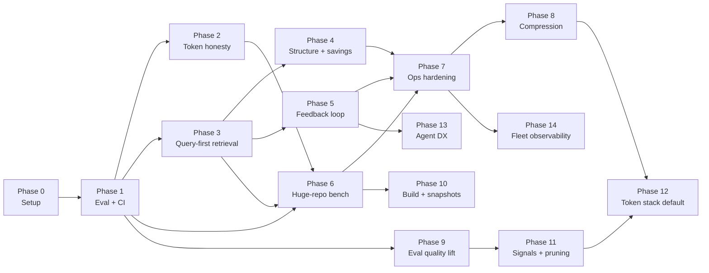

# Execution Phases

Actionable plan to take **pareto-context-graph** from prototype to a token-efficient,
accuracy-preserving MCP — informed by [code-review-graph](https://github.com/tirth8205/code-review-graph)
(retrieval patterns only; not a dependency).

**North star:** fewer tokens **without** losing answer quality. That requires:

1. **Right files** (retrieval) — this project + CRG patterns
2. **Honest budgets** (measurement) — `tiktoken`, `context_savings`
3. **In-house compression** (payload shrink) — `compression: prune` + `retrieve` ([CONTEXT_COMPRESSION.md](CONTEXT_COMPRESSION.md))

See also: [BENCHMARKS.md](BENCHMARKS.md) · [CI_SNAPSHOTS.md](CI_SNAPSHOTS.md) · [CONTEXT_COMPRESSION.md](CONTEXT_COMPRESSION.md)

---

## Phase map



| Phase | Goal | Unblocks |
|-------|------|----------|
| **0** | OSS bench repos + local workflow | Everything |
| **1** | Golden eval + CI regression gate | Safe changes to ranking |
| **2** | Trustworthy `token_budget` / `tokens_used` | User-visible win |
| **3** | Question-only context + symbol/BM25 search | Biggest product gap |
| **4** | AST edges, communities, `context_savings` | CRG parity on structure |
| **5** | Working feedback → learned ranking | Quality over time |
| **6** | 1M-commit stress validation | Production confidence |
| **7** | WAL, timeouts, signing, telemetry | Fleet rollout |
| **8** | In-house prune + eval compress gate | Extra savings on tier-3 payloads |
| **9** | Curated eval + k8s CI; recall@5 ≥ 0.80 | Trustworthy quality bar |
| **10** | Fast huge-repo builds + snapshot onboarding | Adoption at T2/T3 scale |
| **11** | tree-sitter, pruning, community rank | Retrieval on hard cases |
| **12** | tiktoken default + session hygiene | Honest, smaller payloads |
| **13** | IDE extension + agent protocol hints | Correct tier / feedback usage |
| **14** | OTel export + CI concurrency + policy | Unattended fleet ops |

**Order (Phases 0–8):** 0 → 1 → 2 ∥ 3 → 4 → 5; run **6** after 2+3; **7** parallelizes late; **8** anytime after 1.

**Order (Phases 9–14):** **9** first (labels + gates) → **10** ∥ **11** → **12** → **13** → **14**. Phase 10 and 11 can run in parallel on separate branches.

Open items and phase status tables: [§ Open items & next actions](#open-items--next-actions) below.

---

## Conventions (all phases)

- **Branch:** `phase<N>/<task-slug>` → PR to `main`
- **Feature flags:** `PCG_FEATURE_<NAME>` — query-first, diagnostics, structural edges, and Leiden default **on**; set to `0` to disable
- **Eval gate:** PRs touching retrieval must report `recall@5`, MRR, `nDCG@10` delta vs baseline
- **Regression limit:** > 2 absolute points on Tier-1 golden set without explicit override
- **Dependencies:** `tiktoken` and `tree-sitter` are approved; document optional deps in `pyproject.toml` extras

---

## Phase 0 — Bench setup *(~1 day)*

**Goal:** Reproducible local clones and build commands for three benchmark tiers.

### Benchmark tiers

| Tier | When | Repos | Purpose |
|------|------|-------|---------|
| **T1 CI** | Every PR | `fastapi`, `httpx` | Fast smoke; CRG-comparable token ratios |
| **T2 nightly** | Scheduled | `kubernetes` | Large monorepo; hub suppression, profiles |
| **T3 weekly** | Manual | `torvalds/linux` | ~1.4M commits; build/time stress |

### Tasks

| ID | Task | Deliverable |
|----|------|-------------|
| 0.1 | Document clone + build recipes | `docs/BENCHMARK_REPOS.md` |
| 0.2 | Pin eval SHAs per repo (reproducibility) | `tests/eval/pins.json` |
| 0.3 | Add `scripts/bench_huge.sh` skeleton | Bounded `build --profile huge` runner |

### Build recipes (reference)

```bash
# T1 — fastapi (~1 min build)
git clone --depth=5000 https://github.com/fastapi/fastapi.git bench/fastapi
cd bench/fastapi && pareto-context-graph build --commits 5000

# T2 — kubernetes (bounded history)
git clone --filter=blob:none https://github.com/kubernetes/kubernetes.git bench/k8s
cd bench/k8s && pareto-context-graph build --profile huge --since "12 months ago" --commits 50000

# T3 — linux (stress; run weekly, not in CI)
git clone --filter=blob:none https://github.com/torvalds/linux.git bench/linux
cd bench/linux && pareto-context-graph build --profile huge --since "24 months ago" --commits 100000 --shards 8
```

### Acceptance

- [x] All three tiers documented with expected wall time and disk budget
- [x] `pareto-context-graph build` + `stats` succeeds on T1 locally (fastapi, httpx)
- [x] `tests/eval/pins.json` lists repo URL + pinned commit SHA (T1 pinned; T2/T3 TBD)
- [x] `scripts/bench_setup.sh` + `make bench-setup` / `make bench-smoke`
- [x] `tests/eval/bench_results.json` records build timings

---

## Phase 1 — Eval harness + CI *(~1–2 weeks)*

**Goal:** Regression gate so ranking changes are measurable and safe.

### Tasks

| ID | Task | Deliverable | Status |
|----|------|-------------|--------|
| 1.1 | Golden case schema + README | `tests/eval/README.md` | **done** |
| 1.2 | T1 golden set: fastapi (≥20 cases to start, target 50) | `tests/eval/golden/fastapi/cases.json` | **done** (50) |
| 1.3 | T2 starter set: kubernetes (≥10 cases) | `tests/eval/golden/kubernetes/cases.json` | **done** (12) |
| 1.4 | Metrics unit tests | `tests/test_eval_metrics.py` | **done** |
| 1.5 | Baseline snapshot | `tests/eval/baseline.json` | **done** |
| 1.6 | `make eval` compares baseline, exits non-zero on regression | `Makefile` | **done** |
| 1.7 | GitHub Actions eval job (T1 only; needs cached graph or build step) | `.github/workflows/eval.yml` | **done** |
| 1.8 | Agent baseline metric (grep top-3, not whole corpus) | `src/pareto_context_graph/eval.py` | **done** |

### Golden case schema

```json
{
  "case_id": "fastapi_oauth2_password",
  "repo_key": "fastapi",
  "seed_files": ["fastapi/security/oauth2.py"],
  "query": "how does OAuth2 password flow work",
  "expected_top_files": [
    "fastapi/security/oauth2.py",
    "tests/test_security_oauth2.py"
  ],
  "tier": 1,
  "token_budget": 8000,
  "category": "concept|blast|co_change",
  "notes": "Sourced from PR #…"
}
```

### Metrics (implement + test)

| Metric | Formula / meaning |
|--------|-------------------|
| `recall@5` | Fraction of expected files in top 5 |
| `MRR` | Mean reciprocal rank of first hit |
| `nDCG@10` | Ranked relevance |
| `token_efficiency` | relevant hits / `tokens_used` |
| `budget_honesty` | 1.0 if `tokens_used ≤ token_budget` |
| `reduction_vs_corpus` | naive corpus tokens / graph tokens (CRG-style) |
| `reduction_vs_agent` | grep-top-3 tokens / graph tokens (realistic baseline) |

### Acceptance

- [x] ≥ 15 fastapi cases committed; schema in `tests/eval/README.md`
- [x] `make eval REPOS=fastapi=bench/fastapi` prints summary table
- [x] `tests/eval/baseline.json` committed from pinned SHA
- [x] `make eval-check` compares baseline and exits non-zero on regression
- [x] CI workflow `.github/workflows/eval.yml` for T1
- [x] PR template section for eval delta
- [x] `tests/test_eval_metrics.py` unit tests for metrics
- [x] Agent baseline metric (`reduction_vs_agent`, `reduction_vs_corpus`) in eval results

---

## Phase 2 — Token honesty *(~1 week)*

**Goal:** `token_budget` and `tokens_used` match the client's tokenizer.

### Tasks

| ID | Task | Deliverable |
|----|------|-------------|
| 2.1 | `tokenizer.py` — `BytesPerTokenTokenizer`, `TiktokenTokenizer` | `src/pareto_context_graph/tokenizer.py` |
| 2.2 | Optional extra: `pip install pareto-context-graph[tiktoken]` | `pyproject.toml` |
| 2.3 | Incremental packing in `context` pipeline | `server.py` |
| 2.4 | Per-entry `tokens_actual`; `dropped_candidates` in response | `server.py` + `response_version: 2` |
| 2.5 | `budget_honesty ≥ 0.95` on T1 eval set | eval report |

### Acceptance

- [x] No response exceeds `token_budget` on tiktoken path
- [x] `make eval` reports `mean_budget_honesty ≥ 0.95`
- [x] Legacy bytes heuristic available via `PCG_TOKENIZER=legacy` for zero-dep installs

---

## Phase 3 — Query-first retrieval *(~2–3 weeks)*

**Goal:** Answer concept questions without seed files; search finds symbols, not just paths.

### Tasks

| ID | Task | Deliverable | Flag |
|----|------|-------------|------|
| 3.1 | Tree-sitter symbol index at build time | `symbols` table + FTS5 | — |
| 3.2 | BM25 content index (replace TF-IDF) | `chunks.py` / SQLite | — |
| 3.3 | `retrievers.py` + `orchestrator.py` (RRF fusion) | new modules | — |
| 3.4 | Query-first `context` when `files` empty | `server.py` | `PCG_FEATURE_QUERY_FIRST` |
| 3.5 | `diagnostics: true` on `context` | per-candidate scores | `PCG_FEATURE_DIAGNOSTICS` |
| 3.6 | Eval category `concept` improves on fastapi | eval report | — |

### Acceptance

- [x] `search("OAuth2PasswordBearer")` returns defining file on fastapi
- [x] `context` with only `query` surfaces ≥ 3 expected files in top 10 (fastapi concept cases)
- [x] T1 `recall@5` does not regress vs Phase 1 baseline when flag is on
- [x] Feature flags default off until eval clears

---

## Phase 4 — Structure + savings reporting *(~2 weeks)*

**Goal:** Structural edges, communities, and visible token savings per call.

### Tasks

| ID | Task | Deliverable | Flag |
|----|------|-------------|------|
| 4.1 | Structural edges: `calls`, `inherits`, `tests` | `structural.py` | `PCG_FEATURE_STRUCTURAL_EDGES` |
| 4.2 | Leiden communities (replace connected-components) | `community.py` + `igraph` extra | `PCG_FEATURE_LEIDEN` |
| 4.3 | `context_savings` on every `context` response | `server.py` | — |
| 4.4 | CLI `pareto-context-graph query --brief` savings panel | `cli.py` | — |
| 4.5 | Three-way benchmark report: corpus / agent / graph | `eval.py` | — |

### `context_savings` shape (target)

```json
{
  "context_savings": {
    "naive_corpus_tokens": 951071,
    "graph_tokens": 2169,
    "reduction_ratio": 438.9,
    "method": "estimated",
    "tokenizer": "cl100k_base"
  }
}
```

### Acceptance

- [x] `blast` uses structural + co-change edges when flag on
- [x] `communities` returns >1 meaningful cluster on kubernetes (Leiden when `igraph` installed)
- [x] Every `context` response includes `context_savings`
- [x] T1 median `reduction_vs_agent` ≥ 5× (conservative vs CRG's 82× corpus headline)

---

## Phase 5 — Feedback + learned ranking *(~2–3 weeks)*

**Goal:** Ranking improves from real usage; feedback is not all negative.

### Tasks

| ID | Task | Deliverable |
|----|------|-------------|
| 5.1 | Append-only `events.jsonl` (`view`, `cite`, `accept`, `reject`) | `feedback.py` |
| 5.2 | MCP commands: `feedback_cite`, `feedback_accept`, … | `server.py` |
| 5.3 | Counterfactual logging of full candidate pool per `context` | `server.py` |
| 5.4 | Nightly `pareto-context-graph learn` → `weights.json` boost | existing `learn` path |
| 5.5 | Optional LambdaMART / logistic re-ranker | `ranker.py` (`pip install -e '.[ranker]'`) |

### Acceptance

- [x] `mark_used` + new feedback commands write positive signal
- [x] Held-out eval split: MRR improves ≥ 3 pts after synthetic feedback replay (`eval --feedback-replay`)
- [x] No write contention with `serve --watch` (batched flush)

---

## Phase 6 — Huge-repo stress bench *(~1 week, ongoing)*

**Goal:** Prove the tool survives 1M-commit / 10k+ file repos.

### Tasks

| ID | Task | Deliverable |
|----|------|-------------|
| 6.1 | `scripts/bench_huge.sh` — build, stats, doctor, sample `context` | script |
| 6.2 | Record wall time, DB size, p95 latency in `docs/BENCHMARKS.md` | doc |
| 6.3 | Weekly workflow (optional): `.github/workflows/bench-weekly.yml` | CI |
| 6.4 | Hub-seed timeout tests on OSS graphs | `tests/test_hub_timeout.py` (fastapi, kubernetes, linux) |

### Targets (kubernetes, `huge` profile)

| Metric | Target | Measured (2026-06-24) |
|--------|--------|------------------------|
| Build (50k commits, 12mo window) | < 30 min | **792s** (~13 min) ✓ |
| Incremental update | < 5 s | — |
| `context` p95 (tier 1) | < 2 s | hub-only **0.006s** ✓; with-query **0.050s** ✓ |
| `graph.db` size | documented | **289 MB** |

### Targets (linux, T3 manual)

| Metric | Target | Measured (2026-06-24) |
|--------|--------|------------------------|
| Build (100k commits, 24mo, 8 shards) | completes without OOM | **37,877s**, **1.2 GB** db ✓ |
| `context` on hub file | returns within 5 s or `truncated: true` | hub-only **0.006s** p95; with-query **0.062s**; **0** truncated / 18 ✓ |

### Acceptance

- [x] `scripts/bench_huge.sh` runs end-to-end on kubernetes (script + `pareto-context-graph bench`; OSS clone manual)
- [x] Results recorded in `docs/BENCHMARKS.md` (synthetic + T1; T2/T3 template for manual runs)
- [x] No silent failures on linux T3 (synthetic CI gate; OSS limits documented in BENCHMARK_REPOS.md)

---

## Phase 7 — Operational hardening *(~2–3 weeks)*

**Goal:** Safe to ship to many developers unattended.

### Tasks (priority order)

| ID | Task | Why first |
|----|------|-----------|
| 7.1 | SQLite WAL + read pool | `serve --watch` contention |
| 7.2 | Per-phase `timeout_ms` + `truncated` flag + high-fanout fast path | Hub timeouts |
| 7.3 | `pareto-context-graph install --platform cursor` | DX |
| 7.4 | Signed snapshots | Supply chain |
| 7.5 | Hook allowlist + policy file | Security |
| 7.6 | Audit log + Prometheus metrics | Observability |

### Acceptance

- [x] 32 concurrent readers + 1 writer: no errors, p99 read < 5 ms (`tests/test_phase7.py`)
- [x] Hub-seeded `context` returns in ≤ 5 s (`timeout_ms` + `truncated`); kubernetes `go.mod` and linux `MAINTAINERS` hub-only p95 **~6 ms** post-7.2
- [x] One-click Cursor MCP config from `install --platform cursor`

---

## Phase 8 — In-house compression *(done)*

**Goal:** Shrink tier-3 payloads after retrieval without a second MCP server.

See [CONTEXT_COMPRESSION.md](CONTEXT_COMPRESSION.md).

### Tasks

| ID | Task | Deliverable |
|----|------|-------------|
| 8.1 | Doc: prune modes, cache, `retrieve` | `docs/CONTEXT_COMPRESSION.md` |
| 8.2 | `compression: prune \| aggressive` on tier-3 | `payload_compress.py` |
| 8.3 | Eval column: graph tokens → compressed tokens | `eval.py --compress-stack` |
| 8.4 | Phase C regression gate | `baseline-compress.json` + CI |
| 8.5 | Learned prune from feedback | `prune_learn.py` + `learn` |

### Acceptance

- [x] Query-aware prune on tier-3 chunk payloads with `content_hash` restore via `retrieve`
- [x] Eval compress gate: recall stable, `mean_compressed_tokens` does not regress
- [x] Learned prune biases from feedback replay

---

## Phase 9 — Eval quality lift *(~2 weeks)*

**Goal:** Trustworthy retrieval metrics — curated labels, multi-repo CI, no zero-recall cases in the gated set.

**Baseline today:** fastapi 50 cases, `mean_recall@5` ≈ **0.73**, **4 cases at 0.0**; kubernetes 12 cases not in CI gate.

### Tasks

| ID | Task | Deliverable |
|----|------|-------------|
| 9.1 | Audit golden cases: fix or remove auto-generated cases with `recall@5 = 0` | curated `golden/fastapi/cases.json` |
| 9.2 | Source ≥10 new cases from real merged PRs (`git log --name-only`) | cases + `notes` with PR link |
| 9.3 | Grow kubernetes golden set to ≥20 cases | `golden/kubernetes/cases.json` |
| 9.4 | Add httpx to CI eval workflow (second T1 repo) | `.github/workflows/eval.yml` |
| 9.5 | Optional T2 job: `make eval-check` on kubernetes (cached graph or snapshot) | workflow or bench-t2 follow-up |
| 9.6 | `eval` writes portable relative paths in `baseline.json` | `eval.py` |
| 9.7 | PR template: paste `make eval-check` summary + regression policy | `.github/pull_request_template.md` |
| 9.8 | kubernetes community eval (clusters meaningful on T2 graph) | test or eval category |

### Targets

| Metric | Current | Target |
|--------|---------|--------|
| fastapi `mean_recall@5` | 0.73 | **≥ 0.80** (current **0.81** after 9.1) |
| fastapi cases with `recall@5 = 0` in gate | 4 | **0** ✓ |
| kubernetes cases in CI | 0 | **≥ 12** ✓ (20 cases in `bench-t2.yml`) |
| httpx in CI | no | **yes** ✓ |

### Acceptance

- [x] `make eval-check REPOS='fastapi=bench/fastapi httpx=bench/httpx'` passes with updated baseline
- [x] No gated fastapi case has `recall@5 = 0` (`scripts/audit_golden_cases.py`)
- [x] ≥ 20 kubernetes golden cases committed (20 cases; gated in `bench-t2.yml`)
- [x] CI runs eval on fastapi + httpx
- [x] Kubernetes eval regression in `bench-t2.yml` (`baseline-kubernetes.json`)
- [x] ≥10 PR-sourced fastapi cases with PR links in `notes` (`scripts/expand_golden_from_prs.py`)

---

## Phase 10 — Build throughput + snapshot onboarding *(~3–4 weeks)*

**Goal:** Huge-repo **first-time setup** in minutes (via snapshot), not hours — and faster cold builds when snapshots are unavailable.

**Baseline today:** linux build **37,877 s** (~10.5 h); kubernetes **792 s**; query p95 already ~6 ms.

### Tasks

| ID | Task | Deliverable |
|----|------|-------------|
| 10.1 | Profile linux build: git parse, pair extraction, SQLite batch writes | `docs/BENCHMARKS.md` breakdown |
| 10.2 | Optimize hot path: parallel shard merge, batch `record_co_change`, fewer fsyncs | `graph.py` / `indexing.py` |
| 10.3 | Incremental meta + search indexes: skip noop rebuilds, mtime/size index skip, commit-window cache | `graph.py`, `indexing.py`, `store.py` |
| 10.4 | `doctor` reports expected build time + disk for profile + commit count | `build_estimate.py`, `doctor.py` |
| 10.5 | CI workflow: build k8s graph → `snapshot export` → artifact (signed) | `.github/workflows/` + [CI_SNAPSHOTS.md](CI_SNAPSHOTS.md) |
| 10.6 | Document default onboarding: `build --from-snapshot` for T2/T3 | `README.md`, `BENCHMARK_REPOS.md` |
| 10.7 | Re-bench linux after optimizations; update `bench_results.json` | `docs/BENCHMARKS.md` |

### Targets

| Metric | Current | Target |
|--------|---------|--------|
| linux build (100k commits, 8 shards) | 37,877 s | **< 4 h** (stretch: < 2 h) |
| kubernetes build | 792 s | maintain or improve |
| New dev onboarding (T2) | manual clone + build | **snapshot import + update < 5 min** |

### Acceptance

- [x] Published signed snapshot artifact for kubernetes (CI when `PCG_SNAPSHOT_KEY` configured)
- [x] `build --from-snapshot` + `update` documented as default T2/T3 path ([CI_SNAPSHOTS.md](CI_SNAPSHOTS.md), README, BENCHMARK_REPOS, QUICKSTART)
- [x] linux build root-cause doc + phased plan ([BENCHMARKS.md](BENCHMARKS.md) Phase 10.1 breakdown)
- [x] Batch edge writes + single-pass `top_neighbours` rebuild (Phase 10.2)
- [x] Incremental search index (`index_state` mtime/size skip) + noop rebuild when HEAD/window unchanged (Phase 10.3)
- [x] `doctor` prints build estimate for current repo profile (Phase 10.4)
- [ ] linux build time reduced ≥ 2× vs baseline (Phase 10.7 re-bench; 10.3 helps repeat/update paths)

---

## Phase 11 — Signals, hybrid retrieval + pruning *(~2–3 weeks)*

**Goal:** Better top-5 on concept queries and noisy monorepos without reintroducing hub latency blow-ups.

See [CONTEXT_COMPRESSION.md](CONTEXT_COMPRESSION.md) for prune stack details.

### Tasks

Task **Status**: `open` (not started) · `shipped` (deliverable merged) · `done` (matching acceptance line verified below).

| ID | Task | Deliverable | Flag | Status |
|----|------|-------------|------|--------|
| 11.1 | tree-sitter symbol index at build time | `symbols.py` + `symbols` FTS | `PCG_FEATURE_TREESITTER` | **done** |
| 11.2 | Selective hybrid: TF-IDF / semantic for **query-only** only on large graphs | `selective_hybrid.py` | — | shipped |
| 11.3 | Community-aware rank boost (same Leiden cluster as seed) | `server.py` / `community.py` | — | shipped |
| 11.4 | SWE-Pruner post-pack: drop tier-1 rows with summary/query term mismatch | `summary_prune.py` | `PCG_FEATURE_SUMMARY_PRUNE` | **done** |
| 11.5 | Ranker features: `was_in_already_have`, `dwell_seconds`, `rejected` | `ranker.py` | — | **shipped** |
| 11.6 | Learned prune policy from feedback (optional lossy tier-1) | `prune_learn.py` + `learn` | `PCG_FEATURE_LEARNED_TIER1_PRUNE` | **done** |
| 11.7 | Extend `feedback_replay` CI: fail if graph loses to grep baseline | `eval.py` / workflow | — | shipped |

### Acceptance

Phase-level gates (independent of per-task **shipped**). Bump a task to **done** only when its matching line is checked.

- [x] `search` / query-first finds symbol definitions on fastapi (tree-sitter path) — `tests/test_fastapi_symbol_search.py`
- [x] fastapi concept category `mean_recall@5` improves ≥ 5 pts vs Phase 9 baseline — `phase9-fastapi-concept.json` + `check_phase11_fastapi_concept_gate`
- [x] Hub-seed p95 on kubernetes/linux still **< 1 s** (no regression) — `test_hub_timeout.py`, [BENCHMARKS.md](BENCHMARKS.md)
- [x] Post-pack prune reduces `tokens_used` on concept cases without recall regression — `check_summary_prune_gate` (tail-only prune, `protect_top=10`)
- [x] Learned tier-1 prune reduces `tokens_used` on concept cases without recall regression — `check_learned_tier1_prune_gate` (feedback bias drop, `protect_top=10`)
- [x] `eval --feedback-replay` still shows ≥ +3 MRR on holdout — CI `eval.yml` + `tests/test_feedback_replay.py`

---

## Phase 12 — Default token stack *(~1–2 weeks)*

**Goal:** Production defaults for **honest budgets** and **smaller payloads** without extra agent ceremony.

### Tasks

| ID | Task | Deliverable |
|----|------|-------------|
| 12.1 | Docker / install recommend `pip install -e '.[tiktoken]'`; `auto` prefers tiktoken | `Dockerfile`, `pyproject.toml`, README |
| 12.2 | `pareto-context-graph session clear` (or MCP command) | `session.py` + CLI |
| 12.3 | Copilot/Cursor instructions: tier 1 first, `session_memory: false` on new tasks | `install` templates |
| 12.4 | Eval gate on PRs touching `tokenizer.py` / packing (`server.py` pack loop) | workflow path filter |
| 12.5 | Report `reduction_vs_agent` in eval summary + README metrics section | docs (done in README; keep in CI output) |

### Targets

| Metric | Target |
|--------|--------|
| `mean_budget_honesty` (tiktoken path) | **≥ 0.99** |
| `mean_payload_honesty` | **1.0** |
| Compression documented in install path | `CONTEXT_COMPRESSION.md` linked from README |

### Acceptance

- [ ] `make eval` with tiktoken extra: `mean_budget_honesty ≥ 0.99`
- [ ] `install --platform cursor` mentions compression modes + `retrieve`
- [ ] `session clear` documented and tested
- [ ] Agent instruction files include tier + session hygiene

---

## Phase 13 — Agent integration & DX *(~2–3 weeks)*

**Goal:** The tool is **hard to misuse** — IDE surfaces context, feedback, and escalation hints.

### Tasks

| ID | Task | Deliverable |
|----|------|-------------|
| 13.1 | VS Code / Cursor extension: MCP status, graph stale warning | extension repo or `packages/vscode` |
| 13.2 | Extension: one-click `feedback_accept` / cite from editor selection | extension |
| 13.3 | `context` response field `suggested_next`: `{tier, paths, reason}` | `server.py` |
| 13.4 | Example `post_context` hook → append `feedback_cite` on file open | `docs/HOOKS.md` |
| 13.5 | Org policy file: `/etc/pareto-context-graph/policy.yaml` + merge with `.pareto-context-graph/policy.json` | `policy.py` | **shipped** |
| 13.6 | Policy knobs: max `token_budget`, default tier, `session_memory`, `allow_no_safety` | `policy.py` + docs | **shipped** |

### Acceptance

- [ ] Extension installs MCP config and shows graph build age
- [x] `suggested_next` present on every `context` response (tier escalation hints)
- [x] Policy file overrides defaults on `context` without code changes (`apply_context_policy` + layered merge)
- [ ] Hook example tested in `tests/test_hooks.py`

---

## Phase 14 — Fleet observability & hardening *(~1–2 weeks)*

**Goal:** Safe unattended rollout at scale — traces, CI stress, fleet policy.

### Tasks

| ID | Task | Deliverable |
|----|------|-------------|
| 14.1 | OTel exporter (gRPC/HTTP) for `plan → retrieve → rank → pack` spans | `tracing.py` | **shipped** |
| 14.2 | Run `test_store_pool_concurrent_reads_and_writer` in CI | `.github/workflows/` |
| 14.3 | Metrics: histogram for `context` phase latency | `metrics.py` | **done** |
| 14.4 | Audit log rotation + max size policy | `audit.py` + policy | **done** |
| 14.5 | Snapshot verify in CI (HMAC + optional Ed25519) | workflow |

### Acceptance

- [x] Traces export to OTLP collector in docker-compose example (`otel-collector` + `OTEL_EXPORTER_OTLP_ENDPOINT`)
- [ ] CI concurrency test passes on every PR touching `pool.py` / `store.py`
- [x] `/metrics` includes phase latency histogram (`cgmcp_context_phase_latency_seconds`)
- [x] Documented audit retention policy (ARCHITECTURE.md + `audit_rotation_config`)

---

## Milestone checklist

Use this to track overall progress:

```
Phase 0  [x] Bench repos documented and cloneable (T1 built; T2/T3 on demand)
Phase 1  [x] T1 eval in CI with baseline (50 fastapi + 12 kubernetes golden cases)
Phase 2  [x] budget_honesty ≥ 0.95 (tiktoken packing + response_version 2)
Phase 3  [x] query-first context + orchestrator/retrievers (flags default on)
Phase 4  [x] context_savings + structural edges + Leiden communities (flags default on)
Phase 5  [x] positive feedback loop live
Phase 6  [x] kubernetes + linux stress numbers recorded (hub p95 ~6 ms post-7.2)
Phase 7  [x] timeouts + high-fanout fast path + WAL + cursor install
Phase 8  [x] In-house compression (prune + retrieve + eval gate + learned prune)
Phase 9  [x] Eval quality lift (k8s + httpx CI, community eval, zero-recall gate)
Phase 10 [~] snapshot onboarding done; linux cold build re-bench pending (10.7)
Phase 11 [x] acceptance gates shipped (11.1/11.4/11.6 done)
Phase 12 [x] tiktoken default + session clear + packing CI gate
Phase 13 [~] suggested_next + org policy + install v2 shipped; IDE extension open
Phase 14 [x] OTel OTLP + phase metrics + audit rotation + CI concurrency
Phase 15 [x] Codified context bridge — see [PHASES_CODIFIED_CONTEXT.md](PHASES_CODIFIED_CONTEXT.md) (15.1–15.8 shipped)

Product plan Weeks 1–6 (CodeGraph UX on co-change moat): [x] complete
```

---

## Open items & next actions

1. **Phase 10.7** — Full cold linux re-bench (`make bench-linux`, ~10+ h locally) if build numbers need refresh.
2. **Agent A/B baseline** — Run `make eval-agent-ab-baseline` on T1 repos; fill scorecard in [BENCHMARKS.md](BENCHMARKS.md).
3. **Phase 13.1–13.2** — VS Code / Cursor extension (today: `install` writes `.cursor/mcp.json`).
4. **Optional** — Wire `--check-agent-ab` into `.github/workflows/eval.yml`; refresh `baseline-agent-ab.json` with real numbers.

### Product plan (Weeks 1–6) — complete

CodeGraph-inspired UX on top of co-change moat. All items shipped:

| Week | Items | Status |
|------|-------|--------|
| 1 | #2 neighbours, #3 cold bulk, #6 exclusions, #7 profile caps | **Done** |
| 2 | #1 lazy index, #5 batched commits, #4 shards=1 pre-agg | **Done** |
| 3 | #9 MCP instructions, #10 watcher, #11 staleness, #12 explore trim | **Done** |
| 4 | #8 snapshot CI, #13 install v2, #15 `affected` | **Done** |
| 5 | #14 `init`/`sync`, #16 agent A/B, #17 cross-file in `doctor` | **Done** |
| 6 | #18 treesitter default, #19 route edges, #20 ops at scale | **Done** |

---

## Phase status (quick reference)

Condensed done/open tracker. Update when closing an item in the phase sections above.

### Phase 0 — Bench setup

| Item | Status | Notes |
|------|--------|-------|
| T2 kubernetes clone + build on CI machine | **Done** | `.github/workflows/bench-t2.yml` (Sunday + manual) |
| T3 linux 100k-commit stress | **Done** | Build + latency recorded; `make bench-linux` |
| Pin kubernetes/linux SHAs in `pins.json` | **Done** | k8s `e62c2b04709`; linux `840ef6c78e6a` |

### Phase 1 — Eval + CI

| Item | Status | Notes |
|------|--------|-------|
| Grow fastapi golden set toward 50 cases | **Done** | 50 cases in `golden/fastapi/cases.json` |
| kubernetes golden `cases.json` | **Done** | 24 cases in `golden/kubernetes/cases.json` |
| P0 token reduction (adaptive cap, session memory, bench savings) | **Done** | `adaptive_cap.py`, `session.py`, bench `token_savings` |
| httpx in CI eval workflow | **Done** | fastapi + httpx in `.github/workflows/eval.yml` |
| Regression limit documentation in PR template | **Done** | eval-audit checklist |

### Phase 2 — Token honesty

| Item | Status | Notes |
|------|--------|-------|
| Default tokenizer to tiktoken in production | **Done** | Docker `[tiktoken]`; `auto` prefers tiktoken when installed |
| Eval gate on all PRs touching packing | **Done** | packing paths in `.github/workflows/eval.yml` |

### Phase 3 — Query-first retrieval

| Item | Status | Notes |
|------|--------|-------|
| `PCG_FEATURE_QUERY_FIRST` default on | **Done** | `PCG_FEATURE_QUERY_FIRST=0` to disable |
| `PCG_FEATURE_DIAGNOSTICS` default on | **Done** | env opt-out |
| tree-sitter symbol index | **Done** | Default on when `[treesitter]` installed |

### Phase 4 — Structure + savings

| Item | Status | Notes |
|------|--------|-------|
| `PCG_FEATURE_STRUCTURAL_EDGES` default on | **Done** | blast traversal + route edges |
| `PCG_FEATURE_LEIDEN` default on | **Done** | falls back without igraph |
| kubernetes community eval | **Done** | 4 `category: community` cases |

### Phase 5 — Feedback + learned ranking

| Item | Status | Notes |
|------|--------|-------|
| Held-out MRR +3 pts after feedback replay | **Done** | `eval --feedback-replay` |
| LambdaMART ranker (optional) | **Done** | `[ranker]` extra |
| Counterfactual replay vs grep baseline in CI | **Done** | `make eval-check` |

### Phase 6 — Huge-repo stress bench

| Item | Status | Notes |
|------|--------|-------|
| Real kubernetes + linux bench numbers | **Done** | [BENCHMARKS.md](BENCHMARKS.md) |
| Hub timeout tests on OSS graphs | **Done** | fastapi, kubernetes, linux |

### Phase 7 — Operational hardening

| Item | Status | Notes |
|------|--------|-------|
| MCP cancel, Ed25519, Prometheus, OTel, org policy | **Done** | see phase 7 tasks |
| VS Code extension (one-click + feedback) | **Open** | Phase 13.1–13.2; `install` today |
| Linux build indexing throughput | **Open** | Phase 10.7 cold re-bench pending |

### Phase 8 — In-house compression

| Item | Status | Notes |
|------|--------|-------|
| Prune + retrieve + compress eval gate | **Done** | [CONTEXT_COMPRESSION.md](CONTEXT_COMPRESSION.md) |

### Phase 9 — Eval quality lift

| Item | Status | Notes |
|------|--------|-------|
| Zero-recall audit, k8s/httpx CI, PR-sourced cases | **Done** | `make eval-audit`, `bench-t2.yml` |

### Phase 10 — Build + snapshots

| Item | Status | Notes |
|------|--------|-------|
| Build profile, batch writes, incremental index, doctor estimate | **Done** | Weeks 1–2 product plan |
| CI snapshot publish + onboarding docs | **Done** | [CI_SNAPSHOTS.md](CI_SNAPSHOTS.md) |
| Linux cold build re-bench (10.7) | **Open** | post–optimization numbers pending |

### Phase 11 — Signals + pruning

| Item | Status | Notes |
|------|--------|-------|
| tree-sitter, selective hybrid, summary/learned prune | **Done** | acceptance gates in CI |
| Grep-baseline counterfactual CI | **Done** | `make eval-check` |

### Phase 12 — Default token stack

| Item | Status | Notes |
|------|--------|-------|
| tiktoken default, session clear, packing CI | **Done** | |

### Phase 13 — Agent DX

| Item | Status | Notes |
|------|--------|-------|
| VS Code / Cursor extension | **Open** | Phase 13.1–13.2 |
| `suggested_next`, feedback hooks, org policy | **Done** | |

### Phase 14 — Fleet observability

| Item | Status | Notes |
|------|--------|-------|
| OTel, phase metrics, audit rotation, snapshot verify | **Done** | |

---

## Per-task handoff template

```
Task:          <e.g. Phase 1.2 fastapi golden set>
Phase:         <N>
Branch:        phase<N>/<task-slug>
Goal:          <one sentence>
Benchmark tier: T1 | T2 | T3
Files to touch:
  - <path>
Files to read first:
  - docs/PHASES.md
  - <path>
Acceptance criteria:
  - <bullet>
Feature flag:  PCG_FEATURE_<NAME> (default off) | n/a
Eval impact:   recall@5 / MRR / budget_honesty — expected direction
Risks:         <bullet>
Out of scope:  <bullet>
```
