# Quick start

Get **pareto-context-graph** running on a repo and wired into your editor in a few minutes.
For architecture and token strategy, see the [README](../README.md).
For commands and parameters, see [COMMANDS.md](COMMANDS.md).

---

## Prerequisites

- Python **3.10+**
- **Git** CLI in `PATH`
- A git repository with commit history (the repo you want context for)

Optional extras: `pip install pareto-context-graph[tiktoken]` or `pip install -e ".[tiktoken]"` for accurate token counts (recommended; included in Docker image).

Clear stale session paths between tasks: `pareto-context-graph session clear` or MCP `session_clear`.

---

## Standard setup (most repos)

```bash
# 1. Install the package
pip install -e /path/to/pareto-context-graph

# 2. One-shot onboarding in your repo (build + MCP install + next steps)
cd /path/to/your-repo
pareto-context-graph init --platform cursor

# 3. Restart the editor — the AI calls pareto_context_graph on every prompt
```

Equivalent manual steps:

```bash
pareto-context-graph build
pareto-context-graph install --platform cursor
pareto-context-graph serve --watch --interval 600   # optional background sync
```

Verify the graph:

```bash
pareto-context-graph stats
pareto-context-graph doctor
```

`doctor` prints graph health, **cross-file coverage**, symbol index mode, staleness, and a **cold-build time estimate** for your repo profile.

### Day-to-day

```bash
git pull
pareto-context-graph sync              # incremental graph update
pareto-context-graph sync --with-index # also catch up deferred search index
```

Use `sync` instead of `build` when the graph already exists — it only processes new commits.

---

## Huge-repo bootstrap (T2/T3) — snapshot first

Cold builds take **~13 min** (kubernetes) or **~10+ hours** (linux). Use a pre-built snapshot instead.

**Full guide:** [CI_SNAPSHOTS.md](CI_SNAPSHOTS.md)

### Kubernetes (weekly CI artifact)

```bash
git clone --filter=blob:none https://github.com/kubernetes/kubernetes.git
cd kubernetes

# 1. Download kubernetes-graph-snapshot from Actions → Bench T2 (Kubernetes)
export PCG_SNAPSHOT_KEY='<CI secret>'   # if signed

# 2. Bootstrap (import + incremental update)
pareto-context-graph init --from-snapshot ~/Downloads/kubernetes-graph-snapshot.tar.gz \
  --platform cursor --skip-install
pareto-context-graph install --platform cursor

# 3. Verify and serve
pareto-context-graph doctor
pareto-context-graph serve --watch --interval 600
```

Or: `build --from-snapshot …` then `install` (same as `init` without the printed next steps).

### Linux (team export)

```bash
git clone --filter=blob:none https://github.com/torvalds/linux.git
cd linux
pareto-context-graph build --from-snapshot /path/to/linux-graph-snapshot.tar.gz
pareto-context-graph install --platform cursor
```

Export after a one-time build: `pareto-context-graph snapshot export ./linux-graph.tar.gz`

### Day-to-day (T2/T3)

```bash
git pull
pareto-context-graph sync --with-index
```

---

## Backup a built graph

Linux/kubernetes cold builds take hours — export before risky changes:

```bash
pareto-context-graph snapshot export bench/backups/linux-graph-$(date +%Y%m%d).tar.gz
```

Import on another machine:

```bash
pareto-context-graph snapshot import ./linux-graph-YYYYMMDD.tar.gz
pareto-context-graph sync
```

Signing: [CI_SNAPSHOTS.md](CI_SNAPSHOTS.md).

---

## Editor integration



Compression after tier 3: [CONTEXT_COMPRESSION.md](CONTEXT_COMPRESSION.md) (`compression: prune`, `retrieve`).

### VS Code / GitHub Copilot

After `pareto-context-graph install`:

```json
{
  "servers": {
    "pareto-context-graph": {
      "command": "pareto-context-graph",
      "args": ["serve", "--repo", "/path/to/your/repo", "--watch"],
      "type": "stdio"
    }
  }
}
```

Copilot instructions (`.github/copilot-instructions.md`) tell the AI to:

1. Call `pareto_context_graph` with `command="context"` (or `explore` for query-only) before answering
2. Start at tier 1; escalate only as needed
3. Pass `already_have` on follow-ups; use `session_memory: false` on new tasks

### Cursor / Claude Desktop

```json
{
  "mcpServers": {
    "pareto-context-graph": {
      "command": "pareto-context-graph",
      "args": ["serve", "--repo", "/path/to/your/repo", "--watch"]
    }
  }
}
```

Or: `pareto-context-graph install --platform cursor --watch`

---

## Docker

```bash
docker build -t pareto-context-graph:latest .
docker run --rm -i -v /path/to/repo:/workspace pareto-context-graph:latest
```

See `docker-compose.yml` in the repo root.

---

## Python API (no MCP)

```python
from pareto_context_graph.api import ParetoContextGraph

cg = ParetoContextGraph("/path/to/repo")
cg.build()
result = cg.context(files=["src/main.py"], query="add logging", tier=1)
```

---

## Next steps

| Goal | Doc |
|------|-----|
| Huge repo (k8s/linux) snapshot onboarding | [CI_SNAPSHOTS.md](CI_SNAPSHOTS.md) |
| `context` parameters and all commands | [COMMANDS.md](COMMANDS.md) |
| Understand `context` tiers and parameters | [README](../README.md) |
| Architecture + C4 diagrams | [ARCHITECTURE.md](ARCHITECTURE.md) |
| Run golden eval / regression gate | [tests/eval/README.md](../tests/eval/README.md) |
| Agent A/B harness (PCG vs grep+read) | [BENCHMARKS.md](BENCHMARKS.md) |
| OSS benchmark clones | [BENCHMARK_REPOS.md](BENCHMARK_REPOS.md) |
| Feedback + `learn` loop | [FEEDBACK.md](FEEDBACK.md) |

```bash
make eval-check REPOS=fastapi=bench/fastapi httpx=bench/httpx
make eval-agent-ab-check REPOS=fastapi=bench/fastapi httpx=bench/httpx
```
